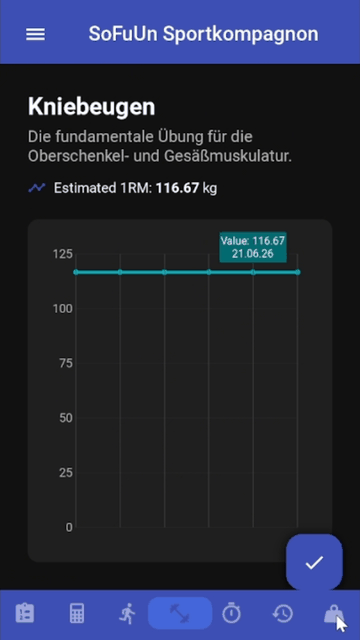

# SoFuUn Sportkompagnon Preview

Welcome to the **SoFuUn Sportkompagnon Preview** repository! 

> ⚠️ **Note for Reviewers & Recruiters:** This repository serves as a functional **Interactive Public Preview** of a comprehensive fitness management ecosystem currently in active development. To protect proprietary logic while demonstrating production-level code quality, several advanced features have been streamlined or scoped out of this public interface, using UI alerts to signify restricted boundaries. 

The fully realized application bridges smooth front-end user experience with a data-driven back-end pipeline built using Kivy/KivyMD and Python.

---

## 🚀 The Vision: Complete Feature Roadmap

The complete production version of **SoFuUn Sportkompagnon** is engineered to be a comprehensive training data hub. The full app ecosystem consists of:

* **Dynamic Plan Creation:** A flexible routine builder supporting custom workout days, structural splits, and multi-layered exercise assignments.
* **Active Workout Tracking:** A seamless, interactive live session interface designed to log reps, weights, and set metrics on the fly.
* **1RM Calculator & Analytics:** Instant evaluation tools to calculate target loads and trace long-term One-Rep Max (1RM) progression charts.
* **Background Rest Timer:** A pacing tool optimized to manage structured training pacing and recovery windows efficiently.
* **Biometric Tracking:** Dedicated data storage to track bodyweight trajectories plotted over historical timeline graphs.
* **Central Exercise Library:** A thoroughly categorized database housing detailed documentation, media guides, and customized PR milestones per exercise.
* **Granular Workout History:** A historical catalog allowing deep analytical reviews of prior training volumes and performance consistency.

---

## 📱 Features & UI Walkthrough (Full Build Showcase)

Because this repository contains a curated preview build, the visual showcase below provides a look at how the complete core workflow modules operate in production:

| 🏋️‍♂️ Workout Tracker & History | 📊 Analytics & Weight DB |
| :---: | :---: |
|  |  |
| *Real-time set tracking with automated One-Rep Max computation.* | *A searchable, fully-normalized relational exercise reference.* |

---

## 🛠️ How to Run the Interactive Preview

Follow these steps to set up the development environment and explore the active frontend interfaces on your local machine:

### 1. Prerequisites
Ensure you have **Python 3.9+** installed on your system. 

### 2. Installation
Clone this repository and navigate into the project directory:

git clone https://github.com/YOUR_USERNAME/YOUR_REPO_NAME.git
cd YOUR_REPO_NAME

Create a virtual environment to isolate dependencies and activate it:

For Windows:
py -3.11 -m venv .venv
venv\Scripts\activate

For macOS/Linux:
python3.11 -m venv .venv
source venv/bin/activate

Install the required cross-platform framework libraries:
pip install -r requirements.txt

### 3. Launching the App
Execute the main application file to launch the local desktop environment interface:
python main.py

### 💡 Exploring the Preview Scope
* **Active Interactions:** Go to the training layout to expand pre-loaded exercises, edit reps/weight values directly inside the text inputs, add new sets dynamically, or test line-item deletions. Your structural input triggers instant backend SQLite commits.
* **Simulated Boundaries:** Tapping locked features (such as creating whole new templates, searching the global exercise catalog, or opening telemetry tools) triggers an embedded warning dialog layout.

---

## 📊 Database Architecture (Preview Sample)

To ensure strict data consistency and high performance, the application utilizes an optimized SQLite relational database structure utilizing foreign key cascades and deterministic storage features. 

The complete production schema implements **9 distinct tables** to manage historical telemetry and detailed user profile configurations. Below is a sample showcasing three of the most sophisticated table definitions engineered for this project:

-- 1. USER PERSONAL RECORDS (Tracks maximum lifting milestones)
-- Demonstrates composite primary keys and real-time stored mathematical column generation (ORM).
CREATE TABLE user_prs (
    profile_id INTEGER NOT NULL,
    exercise_id INTEGER NOT NULL,
    pr_weight REAL NOT NULL,
    pr_reps INTEGER NOT NULL,
    pr_date TEXT NOT NULL,
    -- Automatically computes Epley's One-Rep Max formula on insertion/update to optimize read speeds
    pr_orm REAL GENERATED ALWAYS AS (pr_weight * (1 + (pr_reps / 30.0))) STORED,
    PRIMARY KEY (profile_id, exercise_id),
    FOREIGN KEY (profile_id) REFERENCES profiles(id) ON DELETE CASCADE,
    FOREIGN KEY (exercise_id) REFERENCES exercises(id) ON DELETE CASCADE
);

-- 2. PLAN EXERCISES (Junction table linking exercises to specific workout routines)
-- Demonstrates structured table normalization, cross-referencing, and explicit sequence ordering.
CREATE TABLE plan_exercises (
    id INTEGER PRIMARY KEY AUTOINCREMENT,
    plan_day_id INTEGER NOT NULL,
    exercise_id INTEGER NOT NULL,
    exercise_order INTEGER, -- Maintains strict execution sequence sorting (1, 2, 3...)
    FOREIGN KEY (plan_day_id) REFERENCES plan_days(id) ON DELETE CASCADE,
    FOREIGN KEY (exercise_id) REFERENCES exercises(id) ON DELETE CASCADE
);

-- 3. HISTORY SETS (Stores performance tracking logs over time)
-- Tracks granular performance data points while optimizing historical analytics.
CREATE TABLE history_sets (
    id INTEGER PRIMARY KEY AUTOINCREMENT,
    history_exercises_id INTEGER NOT NULL,
    reps INTEGER NOT NULL,
    weight REAL NOT NULL,
    -- Generates historical progress metrics seamlessly without requiring heavy runtime computation overhead
    orm REAL GENERATED ALWAYS AS (weight * (1 + (reps / 30.0))) STORED,
    FOREIGN KEY (history_exercises_id) REFERENCES history_exercises(id) ON DELETE CASCADE
);

### Key Schema Design Highlights
* **Automated Data Lifecycle (ON DELETE CASCADE):** Complete relational integrity guarantees that when a user deletes a routine or profile, all orphaned dependency records (exercises, sets, history) are instantly purged from database memory.
* **Optimized Compute Overhead (GENERATED ALWAYS AS ... STORED):** Heavy mathematical operations (such as computing Estimated One-Rep Maxes) are written directly to disk during the initial database write stage. This allows analytical queries and charts to render instantly on the frontend with simple O(1) read performance.

---

## 🛠️ Tech Stack & Architecture

* **Frontend:** Kivy & KivyMD (Material Design component styling for cross-platform UI rendering)
* **Backend:** Python 3.11.9
* **Database Engine:** SQLite3 (Structured Relational Storage)
* **Architecture Pattern:** Model-View-Controller (MVC) decoupling design logic from interface layouts.